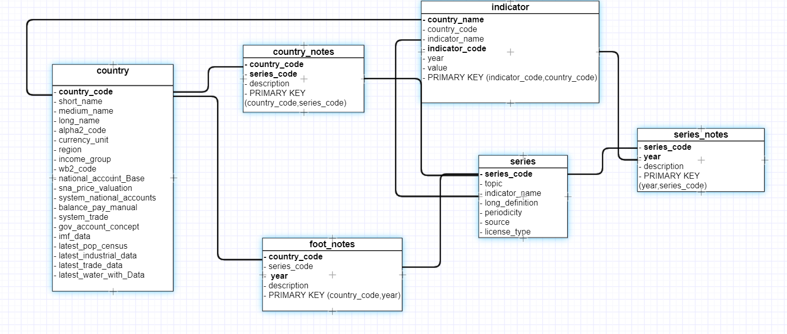
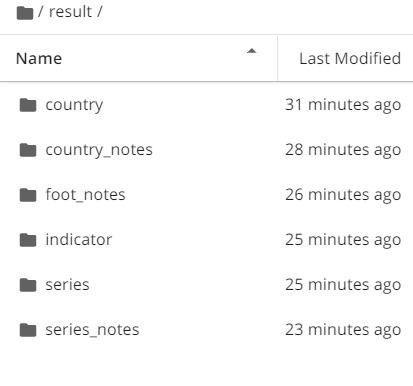
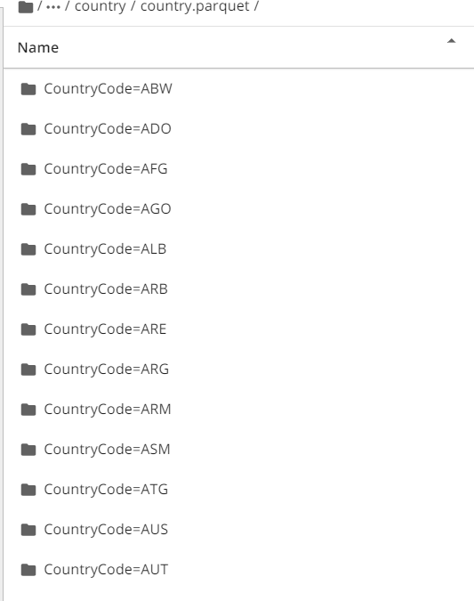
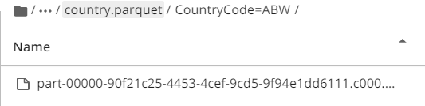

# Data Engineering Capstone Project

# Project Summary
To building an ETL-Pipeline with Spark I loaded a World development indicator  dataset from the from Kaggle. The data gets transformed into an relational data model and passed to an postgreSQL database.

# File Description

 - world.ipynb: main jupyter file contain all the steps of the project 
 - sql_queries.py: contain the sql queries
 - capstone.cfg: aws credentials

 # The database schema design (ER Diagram).
 

# Parquet data glimse
- main result folder

- parquet files 

# Dataset

- **world development data** : https://www.kaggle.com/worldbank/world-development-indicators?select=SeriesNotes.csv